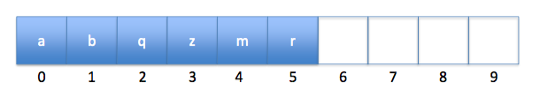

# Data Structure Summary

A data structure is an implementation of an [abstract] interface.

- List
- Queue
- Stack
- Deque [double ended queue]
- Unordered Set [set]
- Sorted Set
- Map [set of key-value pairs]
- Sorted Map [sorted set of key-value pairs (kvp)]

## Access and Modifification Characteristics

|            | get/set             | add/remove          |
|------------|---------------------|---------------------|
| Arrays     | _O(1)_              | _O(1 + min(i,n-i))_ |
| LinkedList | _O(1 + min(i,n-i))_ | _O(1)`*`_           |
| Skiplist   | _O(log n)_          | _O(log n)_          |

`*given a pointer to the location, else traversal is necessary`

## Set

Efficient for contains().

## SortedSet

Efficient for find().

- Does a successor search [closest value ≥ to value]

## Maps

Efficient for contains() [kvp]

## SortedMap

Efficient for find() [kvp]

## Array-based

Efficient for read / write.
Expensive insertion / deletion.

### ArrayList / ArrayStack

Efficient access anywhere.
Efficient insertion / deletion at back [think stack].

- Implements **List** interface with an array
- superceded by ArrayDeque
- **get(), set() in O(1)**
- **add(), remove() in O(1 + n-i)**
- **resize is O(n)** [amortized]

`// memorize: for m ≥ 1 add() / remove() calls, resize() will copy at most 2m`

`// the amortized cost of resize() for m calls is 2m/m = O(1)`

### ArrayQueue / ArrayDeque

Efficient access anywhere.
Efficient insertion / deletion at front and back [think deque].

- Implements **List** interface with an array
- **get(), set() in O(1)**
- **add(), remove() in O(1 + min(i, n-i))**
- **resize is O(n)** [amortized]

`// since ArrayQueue only supports addLast() and removeFirst(), these are O(1)`

### DualArrayDeque

Efficient access anywhere.
Efficient insertion / deletion at front and back [think deque].

- Implements **List** interface
- Uses two **ArrayStacks** front-to-front
- May be rebalanced if one array is much larger than the other
- **get(), set() in O(1)**
- **add(), remove() in O(1 + min(i, n-i))**

### RootishArrayStack

List of Lists, of increasing size.
Efficient space [sqrt(n) wasted space.
Efficient access anywhere.
Efficient insertion / deletion at back.

- Implements the **List** interface using multiple backing arrays
- Reduces 'wasted space' [unused space]
- At most: _sqrt(n)_ unused array locations
- Good for space efficiency
- **get(), set() in O(1)**
- **add(), remove() in O(1 + n-i)**

`// memorize: m ≥ 1 add() / remove() calls, results on O(m) time on resize()`

## Linked Lists

Efficient insertion / deletion.
Expensive access.

### Singly Linked List [SLList]

Nodes with pointer to next node.
Efficient insertion / deletion.
Expensive access.

- Implements the Stack and Queue **interfaces**.
- **get(), set() in O(1 + i)**
- **add(), remove() in O(1)**

### Doubly Linked List [DLList]

Nodes with pointers to previous and next nodes.
Efficient insertion / deletion.
Expensive access.

- Implements the Stack and Queue **interfaces**.
- **get(), set() in O(1 + min(i, n-i))**
- **add(), remove() in  O(1 + min(i, n-i))**

### SELList [Space-Efficient Linked List]

Nodes with pointers to previous and next nodes.
Values stored as blocks in each node. [you can skip data]
Efficient insertion / deletion.
Expensive access.

- Implements the **List** interfaces
- wasted space: { n + O(b + n/b) }
- **get(), set() in O(1 + min(i, n-i)/_b_)**
- **add(), remove() in O(1 + min(i, n-i)/_b_)**

`// memorize: m ≥ 1 add() / remove() calls, results in O(b•m) time on resize()`

## SkipLists

SLL with additional skipping pointers.
Randomly generated structure.
Allows for faster searches.

- Implements the **SortedSet** interface
- **get(), set() in O(log n)**
- **add(), remove() in O(log n)**

