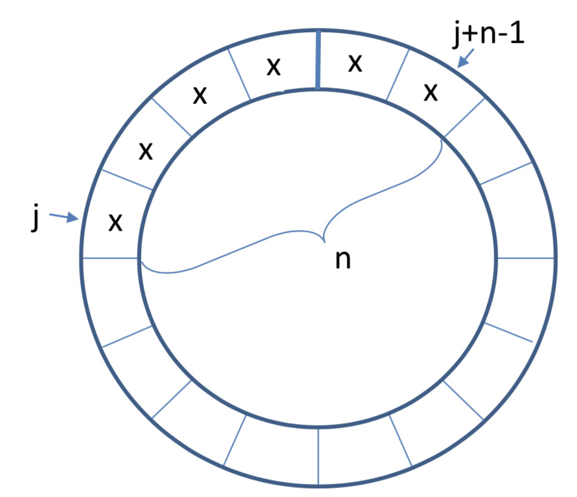
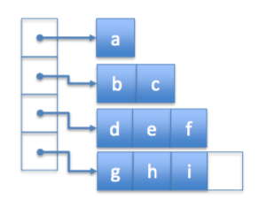
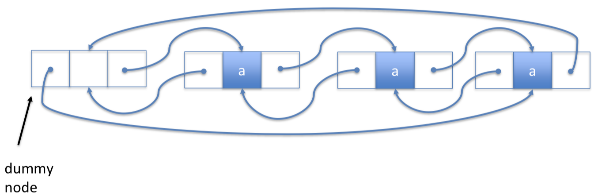
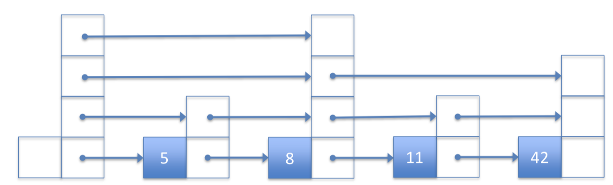
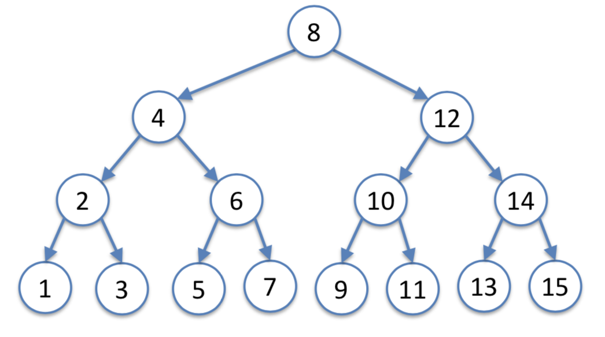
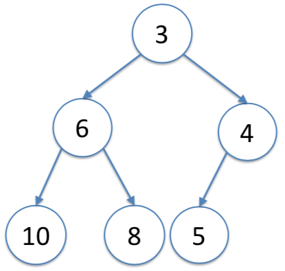

# Data Structure Summary

A data structure is an implementation of an [abstract] interface.

- List
- Queue
- Stack
- Deque [double ended queue]
- Unordered Set [set]
- Sorted Set
- Map [set of key-value pairs]
- Sorted Map [sorted set of key-value pairs (kvp)]

## Access and Modifification Characteristics

|            | get/set             | add/remove          |
|------------|---------------------|---------------------|
| Arrays     | _O(1)_              | _O(1 + min(i,n-i))_ |
| LinkedList | _O(1 + min(i,n-i))_ | _O(1)`*`_           |
| Skiplist   | _O(log n)_          | _O(log n)_          |

`*given a pointer to the location, else traversal is necessary`

## Set

Efficient for contains().

## SortedSet

Efficient for find().

- Does a successor search [closest value ≥ to value]

## Maps

Efficient for contains() [kvp]

## SortedMap

Efficient for find() [kvp]

## Array-based

Efficient for read / write.
Expensive insertion / deletion.

### ArrayList / ArrayStack

Efficient access anywhere.
Efficient insertion / deletion at back [think stack].

- Implements **List** interface with an array
- superceded by ArrayDeque
- **get(), set() in O(1)**
- **add(), remove() in O(1 + n-i)**
- **resize is O(n)** [amortized]

`// for m ≥ 1 add() / remove() calls, resize() will copy at most 2m`

`// the amortized cost of resize() for m calls is 2m/m = O(1)`

### ArrayQueue / ArrayDeque

Efficient access anywhere.
Efficient insertion / deletion at front and back [think deque].

- Implements **List** interface with an array
- **get(), set() in O(1)**
- **add(), remove() in O(1 + min(i, n-i))**
- **resize is O(n)** [amortized]

`// since ArrayQueue only supports addLast() and removeFirst(), these are O(1)`

### DualArrayDeque

Efficient access anywhere.
Efficient insertion / deletion at front and back [think deque].

- Implements **List** interface
- Uses two **ArrayStacks** front-to-front
- May be rebalanced if one array is much larger than the other
- **get(), set() in O(1)**
- **add(), remove() in O(1 + min(i, n-i))**

### RootishArrayStack

List of Lists, of increasing size.
Efficient space [sqrt(n) wasted space.
Efficient access anywhere.
Efficient insertion / deletion at back.

- Implements the **List** interface using multiple backing arrays
- Reduces 'wasted space' [unused space]
- At most: _sqrt(n)_ unused array locations
- Good for space efficiency
- **get(), set() in O(1)**
- **add(), remove() in O(1 + n-i)**

`// m ≥ 1 add() / remove() calls, results on O(m) time on resize()`

## Linked Lists

Efficient insertion / deletion.
Expensive access.

### Singly Linked List [SLList]

Nodes with pointer to next node.
Efficient insertion / deletion.
Expensive access.

- Implements the Stack and Queue **interfaces**.
- **get(), set() in O(1 + i)**
- **add(), remove() in O(1)**

### Doubly Linked List [DLList]

Nodes with pointers to previous and next nodes.
Efficient insertion / deletion.
Expensive access.

- Implements the Stack and Queue **interfaces**.
- **get(), set() in O(1 + min(i, n-i))**
- **add(), remove() in  O(1 + min(i, n-i))**

### SELList [Space-Efficient Linked List]

Nodes with pointers to previous and next nodes.
Values stored as blocks in each node. [you can skip data]
Efficient insertion / deletion.
Expensive access.

- Implements the **List** interfaces
- wasted space: { n + O(b + n/b) }
- **get(), set() in O(1 + min(i, n-i)/_b_)**
- **add(), remove() in O(1 + min(i, n-i)/_b_)**

`// m ≥ 1 add() / remove() calls, results in O(b•m) time on resize()`

## SkipLists

SLL with additional skipping pointers.
Randomly generated structure.
Allows for faster searches.

- Implements the **SortedSet** interface
- Successor search: **find(x) will return smallest value ≥ x**
- **get(), set() in O(log n)**
- **add(), remove() in O(log n)**

## **After Midterm**

## HashTable

- Unordered sets with fast access
- Associative array
  - Index elements into a range of int
  - for non-integer elements, use hashCode()

### ChainedHashTable

- Implements the **USet** interface
- **find(), add(), remove() in O(n_i)**
  - where *n_i* is based of size of list at index

`// m ≥ 1 add() / remove() calls, results in O(m) time on resize()`

## Binary Tree

- Nodes with up to two child nodes

### Binary Search Tree [BST]

- Implements the **SSet** interface
- **find(), add(), remove() in O(n)**

### Random Binary Search Trees [RBST]

Balanced trees are statistically more likely

- Implements the **SSet** interface
- **contructed in O( n•log(n) )**
- ** in O(n)**
- **find(), add(), remove() in O(log n)**

`// search path is at most 2•log(n) + O(1)`

### Treaps

**Has an extra priority:** 
Parent priority should be less than child priority. 
This has the property of bounding the height of the tree.

- Implements the **SSet** interface
- Priorities are randomly applied
- **contructed in O( n•log(n) )**
- **find(), add(), remove() in O(log n)**

### Scapegoat Tree

BST that with height maintained within O(log n), rebuilt if too unbalanced

- Implements the **SSet** interface
- Rebuild only one search path that triggered rebuild
  - this ensures that not entire tree is rebuilt
- **rebuild() in O(log n) amortized**
- **find(), add(), remove() in O(log n)**

`// m calls to add() / remove (), results in O( m•log(n) time spent on rebuild()`

### 2-4 Tree

Tree where every leaf has the same depth.

- Implements the **SSet** interface
- All leaves have equal depth
- All internal nodes have 2-4 children
- **find(), add(), remove() in O(log n) [worst-case]**

### RedBlack Tree

A self-balancing binary search tree, built off a 2-4 Tree, where each node has a 'colour'.

- Implements the **SSet** interface
- Uses colour to remain balanced when adding / removing
  - There is the same number of black nodes on every root to leaf path
  - i.e. equal sum of colours on any root to leaf path
- No red nodes can be adjacent
  - red nodes must have black parent
- left-leaning: if left node is black, then right node must be black
- **Maximum height of 2•log(n)**
- **find(),add(), remove() in O(log n) [worst-case]**

## Binary Search Tree Implementations

|                       | find()                 | add()                  | remove()               |
|------------------|------------------------|------------------------|------------------------|
| BST                   | _O(n)_                 | _O(n)_                 | _O(n)_                 |
| RBST / Treaps         | _O(log n)_ [expected]  | _O(log n)_ [expected]  | _O(log n)_ [expected]  |
| Scapegoat Trees       | _O(log n)_ [amortized] | _O(log n)_ [amortized] | _O(log n)_ [amortized] |
| 2-4 / RedBlack Trees  | _O(log n)_ [worst-case] | _O(log n)_ [worst-case] | _O(log n)_ [worst-case] |

### Sorted Set Implementations

|                          | Runtime                 |
|--------------------------|-------------------------|
| Skiplists                | _O(log n)_ [expected]   |
| Treaps                   | _O(log n)_ [expected]   |
| Scapegoat Trees          | _O(log n)_ [amortized]  |
| **2-4 / RedBlack Trees** | _O(log n)_ [worst-case] |

## Binary Heaps

A complete Binary Tree that also maintains the heap property.

- Implements the [priority] **Queue Interface**
- Allows to find / remove most extreme node with peek() / remove()
- **add(), remove() in O(log n)**
- **peek() in O(1)**

`// m ≥ 1 add() / remove() calls, results in O(m) time on resize()`