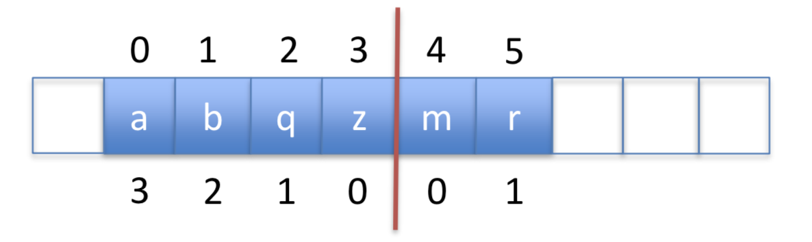

# Data Structure Summary

A data structure is an implementation of an [abstract] interface.

- List
- Queue
- Stack
- Deque [double ended queue]
- Unordered Set [set]
- Sorted Set
- Map [set of key-value pairs]
- Sorted Map [sorted set of key-value pairs (kvp)]

## Read and Write Times

|            | get/set             | add/remove          |
|------------|---------------------|---------------------|
| Arrays     | _O(1)_              | _O(1 + min(i,n-i))_ |
| LinkedList | _O(1 + min(i,n-i))_ | _O(1)_              |
| Skiplist   | _O(log n)_          | _O(log n)_          |

## Set

Efficient for contains().

## SortedSet

Efficient for find().

- Does a successor search [closes value ≥ to expected ]

## Maps

Efficient for contains() [kvp]

## SortedMap

Efficient for find() [kvp]

## Array-based

### ArrayList / ArrayStack

Efficient access anywhere.
Efficient write at back [think stack].

- Implements **List** interface with an array
- superceded by ArrayDeque
- **get(), set() in O(1)**
- **add(), remove() in O(1 + n-i)**
- **resize is O(n)** [amortized]

`memorize: for m add / remove operations, resize() will copy at most 2m`

`the amortized cost of resize() for m calls is 2m/m = O(1)`

### ArrayQueue / ArrayDeque

Efficient access anywhere.
Efficient write at front and back [think deque].

- Implements **List** interface with an array
- **get(), set() in O(1)**
- **add(), remove() in O(1 + min(i, n-i))**
- **resize is O(n)** [amortized]

`// since ArrayQueue only supports addLast() and removeFirst(), these are O(1)`

### DualArrayDeque

Efficient access anywhere.
Efficient write at front and back [think deque].

- Implements **List** interface
- Uses two **ArrayStacks** front-to-front
- Since arrays are quick to add to the end, this makes front and back operations fast
- May be rebalanced if one array is much larger than the other
- Use Potential Function to decide when to rebalance
- **get(), set() in O(1)**
- **add(), remove() in O(1 + min(i, n-i))**
  - quick to access front or back, but not middle

### RootishArrayStack

List of Lists, of increasing size. Efficient space [sqrt(n) wasted space].
Efficient access anywhere.
Efficient write at back.

- Implements the **List** interface using multiple backing arrays
- Reduces 'wasted space' [unused space]
- At most: _sqrt(n)_ unused array locations
- Good for space efficiency
- **get(), set() in O(1)**
- **add(), remove() in O(1 + n-i)**

`memorize: m add() / remove() calls results on O(m) time on resize()`

## Linked Lists

