# COMP 2402 Class Notes

## Java Collections Framework (JCF)

The Java Collections Framework (JCF) is a unified architecture for representing and manipulating collections.

_A collection — sometimes called a container — is simply an object that groups multiple elements into a single unit. Collections are used to store, retrieve, manipulate, and communicate aggregate data. Typically, they represent data items that form a natural group, such as a poker hand (a collection of cards), a mail folder (a collection of letters), or a telephone directory (a mapping of names to phone numbers). If you have used the Java programming language — or just about any other programming language — you are already familiar with collections._

In order to use the JCF you can import it like this.

```java
import java.util.*
```

## Sorting

This is how to sort strings based on length by using anonymous object [**Comparator**].

``` java
Collections.sort(list, new Comparator<String>() {
    public int compare(String x, String y) {
        return x.length() - y.length();
    }
});

// or you can use lambda function
list.sort( (String o1, String o2) -> o1.compareTo(o2) );

// if you want to sort by length and also alphabetically
Collections.sort(list,new Comparator<String>() {
    public int compare(String x, String y) {
        // if not same length, use length
        if(x.length() != y.length()) {
            return x.length() - y.length();
        }
        // else compare as strings
        return x.compareTo(y);
    }
});
```

The **compare(x,y)** method works by moving an element left if the **compare(x,y)** method returns a negative integer, and moves the element right if the **compare(x,y)** returns a positive integer. [difference between x and y]

    (-) x < y
    (0) x = y
    (+) x > y

## Maps [Hashmap]

Also known as dictionaries in Swift or C#...

- Cannot have duplicate entries

``` java
Map<String, Integer> map = new HashMap<>();
map.put("Java", 6);
map.put("Swift", 10);
map.put("C#", 7);
map.put("Ruby", 9);

// this will print out every value in the map [foreach]
for(String str : map.keySet()) {
    System.out.println(str + " : " + map.get(str))
}

map.get(key); // fast operation, returns null if no key found
```

## List

Continuing from previous example...

**Map.Entry** is just a key-value pair

``` java
List<Map.Entry<String,Integer>> entryList = new ArrayList<>();
entryList.addAll(map.entrySet); // set containing all the elements

for(Map.Entry<String,Integer> entry : entrylist) {
    System.out.println(entry.getKey() + " : " + entry.getValue() );
}
```

## Deque [ArrayDeque]

Fast for reading/writing at _start_ or _end_ of list. Basically just a flexible stack/queue.

``` java
Deque<String> dq = new ArrayDeque<>();
dq.addFirst("second");
dq.addFirst("first");
dq.addLast("penultimate");
dq.addLast("last");
```

## Priority Queue

Essentially: uses a heap instead of a tree, in order to keep a certain one on top.
So first element is 'sorted' and then rest is unsorted.

Not good for sorting, or random access.

``` java
Queue<String> pq = new PriorityQueue<>();
pq.addAll(list);

System.out.println(pq.remove());    // remove smallest element
```

If alphabetical, one that starts with 'a' will be removed. After first element, the queue is not sorted. Removing one will promote next smallest to the top

## Asymptotic Notation [Big O]

Used to analyze complexity of algorithms, to find faster, or which ones requires more space.

### Comparing data structures

- Time
- Space
- Correctivenes

### Growth rates proportioanl to n

- If input doubles in size, how much will runtime increase?

### Runtime as a count of primative operation

- This is machine independent
- Proportional to exact runtimess

``` java
for(int i = 0; i < n; i++) {
    arr[i] = i;
}
```

Runtime:

- **1**: assignment [int i = 0]
- **n+1**: comparisons [i < n]
- **n**: increments [i++]
- **n**: array offset calculations [arr[i]]
- **n**: n indirect assignments [arr[i] = i]

### Definition of Big O

After a certain point, g(x) will grow as fast [or faster] than f(x)

- g(x) is the upper limit to f(x)

`O(g(n)) ∀ (f(n) < c•g(n))`

### Orders of growth

| Complexity   | Name         |
|:-------------|:-------------|
| O(1)         | Constant     |
| O(log n)     | Logarithmic  |
| O(n)         | Linear       |
| O(n•log(n))  | Quasilinear  |
| O(n^2)       | Quasilinear  |
| O(2^n)       | Exponential  |
| O(n!)        | Factorial    |

</br>

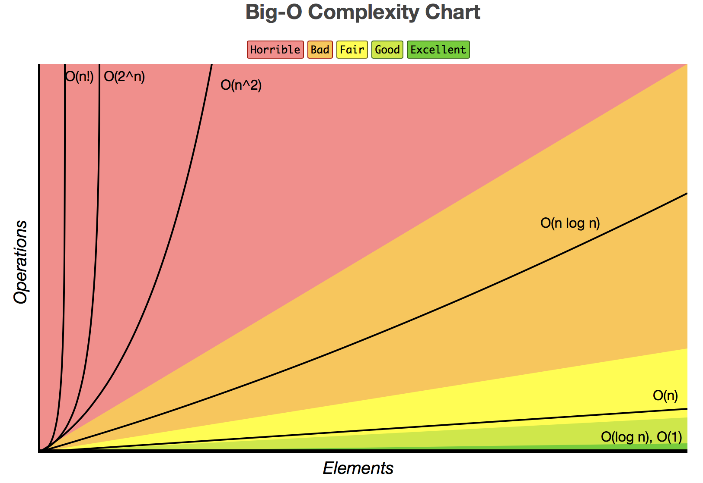

### Tips

- Only largest values matter
- Drop all coefficient
- Log bases are all equivalent

### Example

``` java
public class BigO {
    public static void main() {
        String str = "";
        int n = 100;    // O(1)

        for(int i = 0; ,< n; i++) {     // O(n)
            str += "x";     // O(1) but n times
        }

        for(int i = 0; i < n; i+=2) {    // n/2 times -> O(n)
            str += "y"      // O(1)
        }

        // this is roughly the same as if n was n/2 with O(n)
        for(int i = 0; i < n; i*=2) {    // O(log n)
            str += "y"      // O(1)
        }
    }
}
```

## Array-based Data Structures

### ArrayStack [ArrayList]

- Implements **List** interface with an array
- Similar to ArrayList
- Efficient only for stack operations [back]
- superceded by ArrayDeque
- **get(), set() in O(1)**
- **add(), remove() in O(1 + n-i)**
  - good for write at the back

### Stacks vs List

| Stack  | List        |
|--------|-------------|
|push(x) |add(n,x)     |
|pop()   |remove(n-1)  |
|size()  |size()       |
|peek(x) |get(n-1)     |

### List Interface

- get(i) / set(i,x)
  - Access element i, and return/replace it
- size()
  - number of items in list
- add(i,x)
  - insert new item x at position i
- remove(i)
  - remove the element from position i

_dereferencing:_ getting the address of a data item

#### Amortized Cost

When an algorithm has processes that may be much longer but usually is quick, so you take the average. [roughly]

e.g. resizing an an array when adding/removing

### ArrayQueue & ArrayDeque

Allow for efficient access at front and backs.

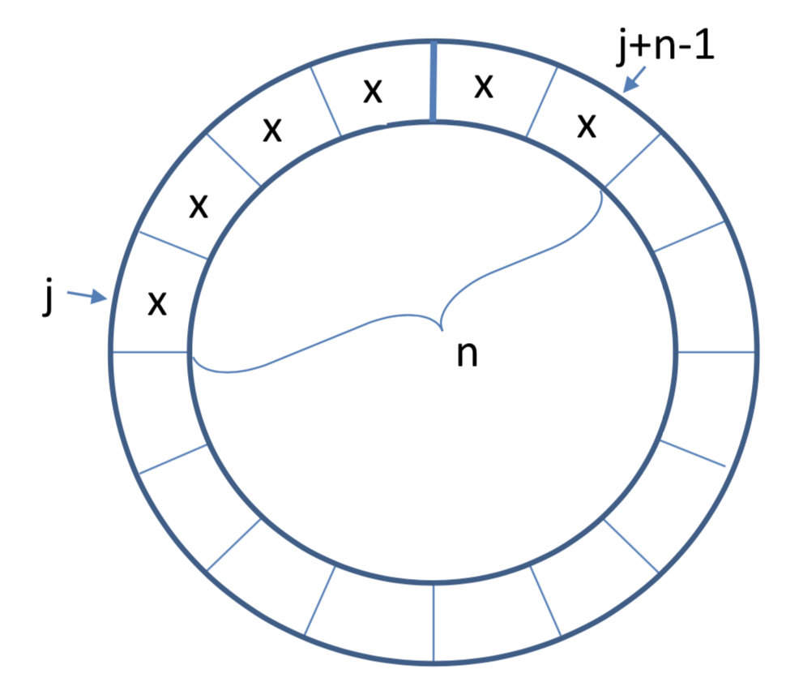

#### ArrayQueue

- Implements **Queue** and **List** interfaces with an array
- Cyclic array, (n: number of elements, j: 'index' of last element)
- **get(), set() in O(1)**
- **add(), remove () in O(1 + min(i, n-i))**
  - quick to write at front or back
  - cannot access anywhere else
- **resize is O(n)**

#### ArrayDeque

- Implements **List** interface with an array
- **get(), set() in O(1)**
- **add(), remove() in O(1 + min(i, n-i))**
  - quick to write at front or back
  - not so quick to access middle
- **resize is O(n)**

### DualArrayDeque

- Implements **List** interface
- Uses two **ArrayStacks** front-to-front
- Since arrays are quick to add to the end, this makes front and back operations fast
- May be rebalanced if one array is much larger than the other
- Use Potential Function to decide when to rebalance
- **get(), set() in O(1)**
- **add(), remove() in O(1 + min(i, n-i))**
  - quick to write at front or back, but not middle

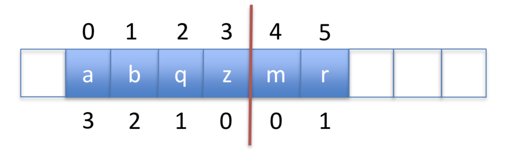

#### Potential Function

Define a potential function for the data structure to be the absolute difference of the sizes of the two stacks

`P = | front_array.size - back_array.size |`

- Adding or removing an element can only increase/decrease 1 to this function

### RootishArrayStack

- Implements the **List** interface using multiple backing arrays
- Reduces 'wasted space' [unused space]
- At most: _sqrt(n)_ unused array locations
- Good for space efficiency
- **get(), set() in O(1)**
- **add(), remove() in O(1 + n-i)**
  - quick to write at the back

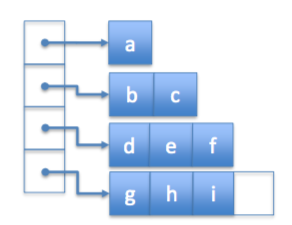

## Linked Lists

- Recursive data structure made up of nodes
- Pointers to head and tail, and each node points to the next node
- Efficient add/remove but slow read/write

### SLList [Singly-Linked List]

- Implements the **Stack** and **Queue** interfaces
- **push(), pop() in O(1)**
- **add(), remove() in O(1)**

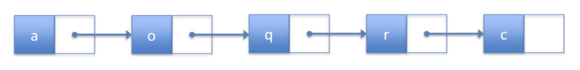

### DSList [Doubly-Linked List]

- Forward and backwards pointers at each node
- Implements the **List** interfaces
- **get(), set() in O(1 + min(i, n-i))**
- **add(), remove() in O(1 + min(i, n-i))**

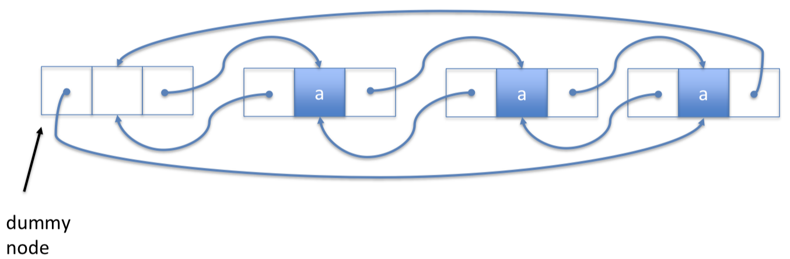

### SELList [Space-Efficient Linked List]

- Like a doubly-linked list, but uses block size _b_
- Is a series of **ArrayDeque** with _next_ and _prev_ pointers
- Implements the **List** interfaces
- **get(), set() in O(1 + min(i, n-i)/_b_)**
- **add(), remove() in O(1 + min(i, n-i)/_b_)**
  - is quicker because you can skip blocks of data

## Skiplist

- Like a singly-linked list, with 'skips'
- Randomly generated structure
- Faster searches than linked lists
- Additional nodes with pointers that allow 'skipping'
- Successor search: **find(x) will return smallest value ≥ x**
- **find(), add(), remove() in O(log n)**

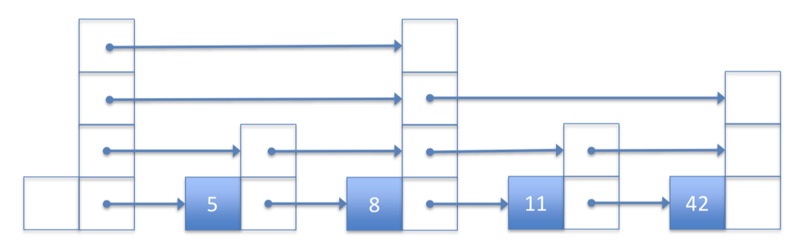

## List Implementations

|            | get/set             | add/remove          |
|------------|---------------------|---------------------|
| Arrays     | _O(1)_              | _O(1 + min(i,n-i))_ |
| LinkedList | _O(1 + min(i,n-i))_ | _O(1)`*`_           |
| Skiplist   | _O(log n)_          | _O(log n)_          |

`*given a pointer to the location, else traversal is necessary`

## Definitions

**Random variable:** a random sample from a group of values

**Expected value:** average value of a random variable

**Indicator variable:** random variable with values of 0 or 1

**Linearity of Expectation:** the expected value of a sum is equal to the sum of expected values

`Expected height of node [if coin flips were used]:`

    P(x = 1) = 1/2      // prob. that tails on first flip
    P(x = 2) = 1/4      // prob. that tails on second flip
    P(x = 3) = 1/8      // prob. that tails on third flip
    ...
    P(x = i) = 1/(2^i)

    Thus,
    E[x] = i*Sum(1/2^i)       // for all natural numbers
    E[x] = Sum(E[I_j])
    E[x] = Sum(P(I_j = i))

    Indicator variable: 1 if tails, 0 is heads
    P(I_1 = 1) = 1
    P(I_2 = 1) = 1/2
    ...
    P(I_j = 1) = 1/(2^(i-1))

    let S = Sum(P(x = i)) = 1 + 1/2 + 1/4 + ...

    therefore,
    S/2 = 1/2 + 1/4 + 1/8 + ...

    S - S/2 = 1
    => S = 2

     E[x] = Sum(P(I_j = i)) = S = 1 + 1/2 + 1/4 + ...
     E[x] = 2

 `Expected number of elements in the skiplist:`

    E[n_i] = ?

    I_(i,j) = 1 if in list, 0 is not in list
    // i is 0...n-1, number of nodes in list

    // expected value of sum of indicator(element in list)
    E[n_i] = E[ Sum( I_(i,j) ) ]
    E[n_i] = Sum( E[ I_(i,j) ] )
    E[n_i] = Sum( 1/(2^i) )     // average number values in each node
    E[n_i] = n * ( 1/(2^i) )    // average height(node) * number of nodes

`Average height of skiplist:`

    h = # of levels in list

    I_i = 1 if level is not empty, 0 if level empty

    // expected value of sum of indicator(level not empty)
    E[h] = E[ Sum( I_i ) ]      // from 0...infinity [no max height]
    E[h] = Sum( E[ I_i ] )

    I_i ≤ n_i   // if level exists, less likely than number of nodes

    E[I_i] ≤ E[n_i] = n/(2^i)

    // use log(n) since we know to prove O(log n)
    E[h] = E[ I_i ]{ from [0] to [log(n)] }
           + E[ I_i ]{ from [log(n) + 1] to [infinity] }

    E[h] = [ log(n) + 1 ] + [ 1 ]       // because math

    E[h]  = log(n) + 2 ≤ log(n) + 3

`Average length of skiplist:`

    R_i = # of horizontal steps at level ≤ n_i
    l = Sum(R_i)

    E[R_i] ≤ E[ # node height not promoted ]
    E[R_i] ≤ E[ # node height promoted ] - 1
    E[R_i] ≤ S - 1      // S = 2 from above
    E[R_i] ≤ 1

    let sp = total length of search path
    E[sp] = E[h] + E[l]
    E[sp] = ( log(n) + 3 ) + E[ Sum(R_i) ]
    E[sp] = ( log(n) + 3 ) + Sum( E[ R_i ] )
    E[sp] ≤ ( log(n) + 3 )
            + Sum(1){ from [0] to [log(n)] }
            + Sum( E[ n_i ] ){ from [log(n) + 1] to n }
    E[sp] ≤ ( log(n) + 3 )
            + log(n)
            + Sum( n/(2^i) ){ from [log(n) + 1] to n }
    E[sp] ≤ 2*log(n) + 6

    E[sp] = O(log n) + O(1)

## HashTables

- Unordered sets with fast access
- Associative array
  - Index elements into a range of int
  - for non-integer elements, use hashCode()

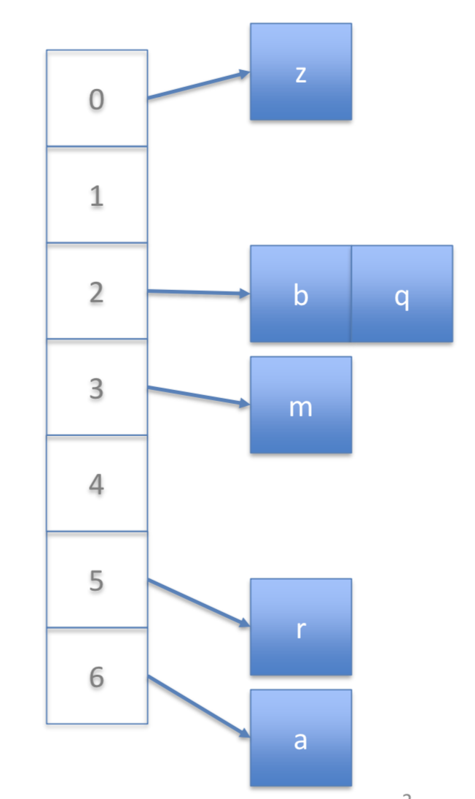

### Hashing

- Computing an [integer] index into the array

### ChainedHashTable

- Implements the **USet** interface
- **find(), add(), remove() in O(n_i)**
  - where *n_i* is based of size of list at index

`// m ≥ 1 add() / remove() calls, results in O(m) time on resize()`

### Universal Hashing

    A hash function, hash(x):int -> {0,...,m-1}, is
    universal if, for any elements x, y:

    1. if x == y, then hash(x) == hash(y)

    2. if x != y, then Prob{ hash(x) == hash(y) } = 1/m

- If a hash function gives probablility of 2/m, then it can be called _nearly-universal_

### HashCodes

Methods of Java Object:

- .hashCode(), integer representation of object
- .equals(), compare two object references

Equal objects must have equal hash codes

- a.equals(b) => a.hashCode() == b.hashCode()

but, reverse is not true:

- a.hashCode() == b.hashCode() =/> a.equals(b)
  - Same hashcode does not imply, same object
- !a.equals(b) =/> a.hashCode() != b.hashCode()
  - Different object does not mean different hashcode

## Binary Trees

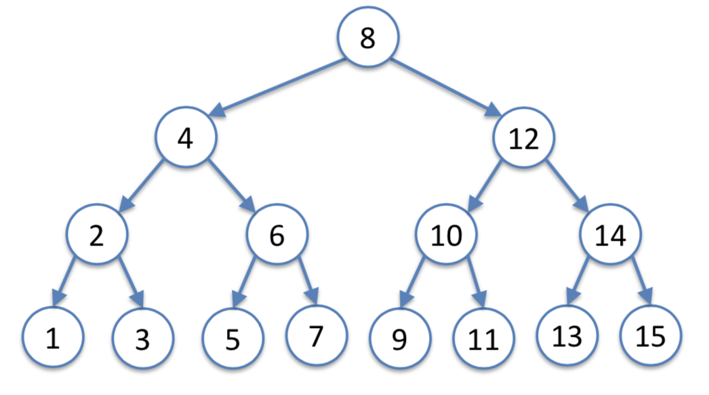

**Root:** top-most node
**Internal:** nodes that have children
**Leaf:** nodes with no children
**External:** null nodes [children of leaf nodes]

**Depth:** distance from root
**Level:** set of nodes at same depth
**Height:** largest depth for subtree at node
**Size:** number of nodes for subtree at node [inclusive of current node]

How to calculate the size of a subtree [recursively]

``` java
int size(Node u) {
    if(u == null) return 0; // external node
    // add one each time, count this node
    return size(u.left) + size(u.right) + 1;
}
```

How to calculate the height of a subtree [recursively]

``` java
int height(Node u) {
    if(u == null) return -1; // external node, went too far
    // add one each time, count this node
    return max( height(u.left) + height(u.right) ) + 1;
}
```

How to calculate the depth of a node [recursively]

``` java
int depth(Node u) {
    if(u == null) return -1; // root node, went too far
    // add one each time, count this node
    return depth(u.parent) + 1;
}
```

### Binary Search Tree [BST]

- Implements the **SSet** interface
- **find(), add(), remove() in O(n)**

### Adding Node to Binary Search Tree

``` java
boolean addNode(x) {
    last = FindLast(x);  // successor search
    if(x == last) return false; // no duplicates
    if(x.value < last.value)
        last.right = x;
    else
        last.left = x;
    return true;
}
```

### Removing Node from Binary Search Tree

**Case 1:** Node is a leaf [no children]

- Just remove node.

**Case 2:** Node has one child

- Node can be replaced by child node

**Case 3:** Node has two children

- Replace the node with inorder successor
  - replace with node at lower level, favouring left side

### Random Binary Search Trees [RBST]

Balanced trees are statistically more likely.

- Implements the **SSet** interface
- **contructed in O( n•log(n) )**
- **add(), remove(), find()) in O(log n)**

`// search path is at most 2•log(n) + O(1)`

### Treaps

**Has an extra priority:**</br>
Parent priority should be less than child priority.</br>
This has the property of bounding the height of the tree.

- Implements the **SSet** interface
- Priorities are randomly applied
- **contructed in O( n•log(n) )**
- **find(), add(), remove() in O(log n)**

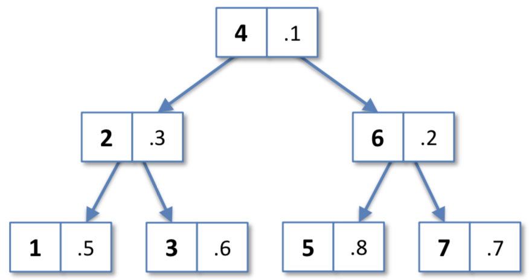

### Scapegoat Tree

BST that with height maintained within O(log n), rebuilt if too unbalanced.</br>
Limited with integer q, where height ≤ log_{3/2}(q)

- Implements the **SSet** interface
- Rebuild only one search path that triggered rebuild
  - this ensures that not entire tree is rebuilt
- **rebuild() in O(log n) amortized**
- **find(), add(), remove() in O(log n)**

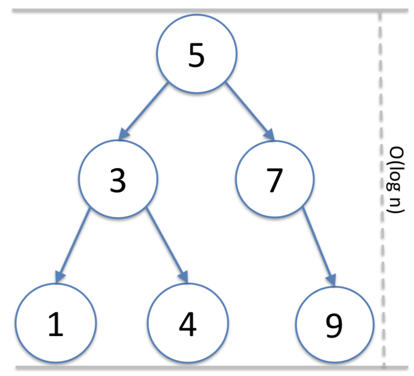

`// m calls to add() / remove (), results in O( m•log(n) time spent on rebuild()`

## Binary Search Tree Implementations

|                       | find()                 | add()                  | remove()               |
|------------------|------------------------|------------------------|------------------------|
| BST                   | _O(n)_                 | _O(n)_                 | _O(n)_                 |
| RBST / Treaps         | _O(log n)_ [expected]  | _O(log n)_ [expected]  | _O(log n)_ [expected]  |
| Scapegoat Trees       | _O(log n)_ [amortized] | _O(log n)_ [amortized] | _O(log n)_ [amortized] |
| 2-4 / RedBlack Trees  | _O(log n)_ [worst-case] | _O(log n)_ [worst-case] | _O(log n)_ [worst-case] |

### Sorted Set Implementations

|                          | Runtime                 |
|--------------------------|-------------------------|
| Skiplists                | _O(log n)_ [expected]   |
| Treaps                   | _O(log n)_ [expected]   |
| Scapegoat Trees          | _O(log n)_ [amortized]  |
| **2-4 / RedBlack Trees** | _O(log n)_ [worst-case] |

### 2-4 Tree

Tree where every leaf has the same depth.

- Implements the **SSet** interface
- All leaves have equal depth
- All internal nodes have 2-4 children
- **find(), add(), remove() in O(log n) [worst-case]**

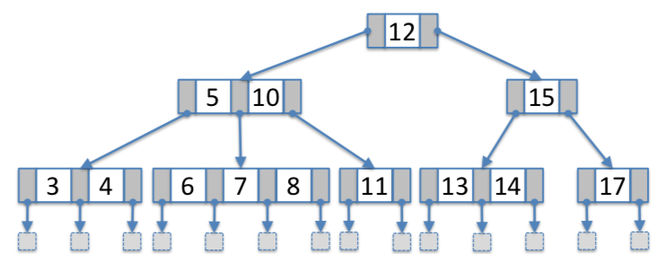

### RedBlack Tree

A self-balancing binary search tree, built off a 2-4 Tree, where each node has a 'colour'.

- Implements the **SSet** interface
- Uses colour to remain balanced when adding / removing
  - There is the same number of black nodes on every root to leaf path
  - i.e. equal sum of colours on any root to leaf path
- No red nodes can be adjacent
  - red nodes must have black parent
- left-leaning: if left node is black, then right node must be black
- **Maximum height of 2•log(n)**
- **find(),add(), remove() in O(log n) [worst-case]**

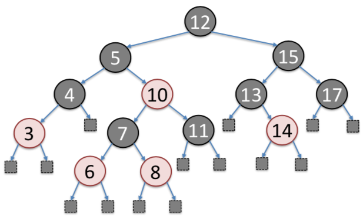

#### Adding Node to RedBlack Tree

Case 0: black parent...

**Case 1:** Adding red node with red parent, but black uncle

- Rotate left or right at black grandparent
- Parent (Red->Black)
- Grandparent (Black->Red)

**Case 2:** Adding red node with red parent and red uncle

- make grandparent red, and parent and uncle black

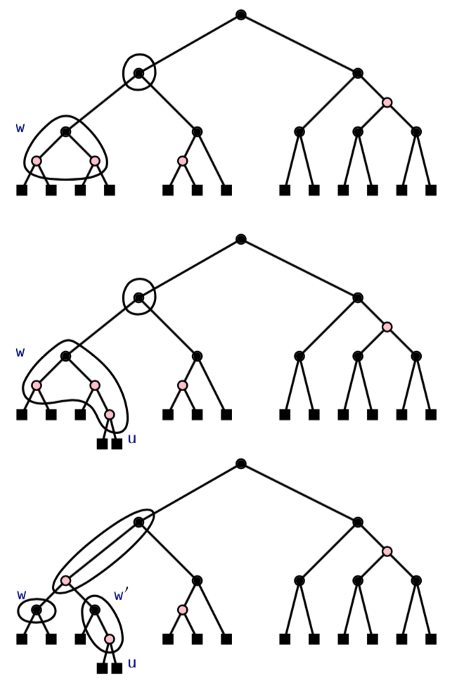

## Heaps

**Heap Property:** Each node is more extreme than [or equal to] its parent.

### Binary Heaps

A complete Binary Tree that also maintains the heap property.

- Implements the [priority] **Queue Interface**
- Allows to find / remove most extreme node with peek() / remove()
- **add(), remove() in O(log n)**
- **peek() in O(1)**

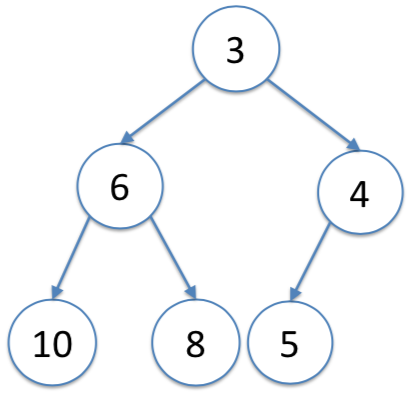

`// m ≥ 1 add() / remove() calls, results in O(m) time on resize()`

### Eytzinger Method

A method to represent a complete binary tree as an array

**Parent:** can be found at (i-1)/2
**Left Child:** can be found at 2i+1
**Right Child:** can be found at 2i+2

### Meldable Heap

A randomized heap, not bound by an shape or balancing.

- Implements the [priority] **Queue Interface**
- Simpler to implement, and good worst-case time efficiency
- **add(), remove() in O(log n)**

### Random Walks

A path through a binary tree [i.e. the expected depth of a node].

- Starting from root node
- Random chance to go to left to right child
- Ends at external nodes

`// The expected depth of a node is ≤ log(n+1)`

## Sorting Alogrithms

**In-place:** means modifying list to be sorted [as opposed to returning new sorted list].
**Stable:** means the order of elements with equal values is preserved.

### Lower bound on Comparion-based Sorting

For a comparion-based algorithm, the expected number of comparions is Ω(n•log(n)).

### Merge Sort

Sort list by merging sorted sub-lists, reduces total number of comparisons needed.

    1. Divide list into equally sized halves until 1 element per sub-list
    2. Sort sub-list [recursively]
    3. Merge sub-list using comparator

- Comparison-based
- **Not in-place**
- **Stable**
- **Runs in O(n•log(n)) time**

`// performs at most n•log(n) comparisons`

### Heap Sort

Sort by traversing down a heap tree.

    1. Create a heap from list
    2. Delete the root node [in list, a[n-1]]
        - Now root is in a[n], since n--
    3. Heapify [make sure heap property is preserved]
    4. Repeat steps 2-4 until no more elements to sort

- Comparison-based
- **In-place**
- **Not stable**
- **Runs in O(n•log(n)) time**

`// performs at most 2n•log(n) + O(n) comparisons`

### Quick Sort

Sort using a randomly selected value as pivot point, then sorting the sub-lists.</br>
Since random selection, might choose worst value [ideally middle value].

    1. Randomly select value
    2. Add all values less than to left sub-list, otherwise add to right sub-list
    3. Repeat until 1 element in sub-list

- Comparison-based
- **In-place**
- **Not stable**
- **Runs in O(n•log(n)) [expected] time**

`// performs at most 2n•log(n) + O(n)`

### Comparison-based Algorithms

|            | Comparisons                        | In-place | Stable |
|------------|------------------------------------|----------|--------|
| Merge Sort | _n•log(n)_ [worst-case]            | no       | yes    |
| Heap Sort  | _1.38n•log(n) + O(n)_ [worst-case] | yes      | no     |
| Quick Sort | _2n•log(n) + O(n)_ [expected]      | yes      | no     |

**Merge Sort:**

- Fewest comparisons
- Does not rely on randomization [guaranteed runtime]
- Not in-place [expensive memory usage]
- Stable
- Much better at sorting a linked list
  - no additional memory is needed with pointer manipulation

**Quick Sort:**

- Second fewest comparisons
- Randomized [expected runtime]
- In-place [memory efficient]
- Not stable

**Heap Sort:**

- Most comparisons
- Not randomized [guaranteed runtime]
- In-place  [memory efficient]
- Not stable

### Counting Sort

Counting array is used to keep track of duplicates; it is then used to construct the sorted list.

- Not comparison-based
- **Not in-place**
- **Not stable**
- **Runs in O(n+k) time**
  - n integers
  - range of 0...k

`// efficient for integers when the length is roughly equal to maximum value k-1`

### Radix Sort

Sorts w-bit integer with counting sort on d-bits per integer [least to most significant]

- Not comparison-based
- **Not in-place**
- **Not stable**
- **Runs in O(c•n) time**
  - n w-bit integers
  - range of 0...(n^c - 1)

## Graphs

A graph is a pair of sets: G(V,E)

- **V** is the set of all vertices
- **E** is the set of all edges

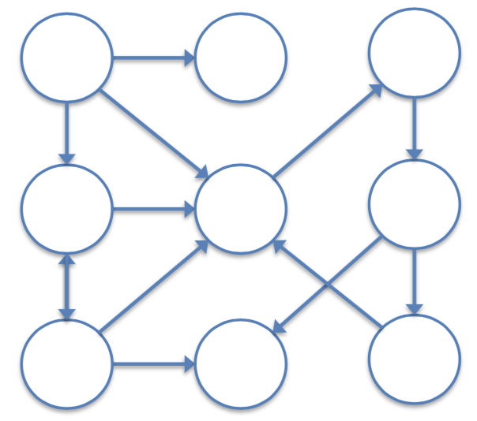

### Graph Interface

Interface that defines characteristics of a graph

- **addEdge(i,j):** adds an edge between nodes i and j
- **emoveEdge(i,j):** removes edge between nodes i and j
- **hasEdge(i,j):** returns true if edge exists between nodes i and j
- **outEdges(i):** returns set of all outbound edges from node i
- **inEdges(i):** returns set of all inbound edges from node i

|            | Adjacency Matrix    | Adjacency List      |
|------------|---------------------|---------------------|
| addEdge    | _O(1)_              | _O(1)_              |
| removeEdge | _O(1)_              | _O(deg(i))_         |
| hasEdge    | _O(1)_              | _O(deg(i))_         |
| outEdge    | _O(n)_              | _O(1)_              |
| inEdge     | _O(n)_              | _O(n+m)_            |
|            |                     |                     |
| space used | _O(n^2)_            | _O(n+m)_            |

`• n is the number of nodes`</br>
`• m is the number of edges`

### Adjacency Matrix

An _n x n_ matrix representing adjacent nodes.

- useful for dense graphs [approx. n^2 edges]
  - memory usage is acceptable
- Matrix algebraic operations to computer property of graph
  - like finding shortest paths between all pairs of vertices

### Adjacency List

Stores all outbound edges from a node.

- Is better to use than **Adjacency Matrix** if memory restricted, or for outEdges()

e.g.

| Source Node (n) | Adjacent Nodes (m) |
|-----------------|--------------------|
| 0               | 2,4,5,6            |
| 1               | 2,3                |
| 2               | 5                  |
| 3               | 0,6,3              |
| 4               | 1,2,3,5,6          |
| 5               | 0,6                |
| 6               | 4,6                |

### Graph Traversal

We can use Breadth-first or Depth-first search order to visit every node.

**Preorder:** Start at the root node, go left always, else go right</br>
[visits each node **before its children**]

- Used to copy the tree

**Inorder:** All nodes from left to right [visually]</br>
[visits each node **after its left** children]

- Useful for getting size of all subtrees

**Postorder:** Bottom to top, with left priority</br>
[visits node **after its children**]

- Used to delete tree

#### Breadth-first Search

Go through all adjacent nodes first the.

- Good for finding quickest paths from one node to another [but not unique paths].
  - There could be equally quick paths not found

**Process:**

- You do this with a queue and list
  - queue stores position we are at
    - add all unseen adjacent nodes to queue and seen list
    - remove value from queue
    - go to removed value, repeat
  - list stores nodes we have seen
    - so that seen values are not added to queue

#### Depth-first Search

Go through list based of a priority.

- Good for finding node with highest / lowest priority?

**Process:**

- You do this with a stack and list
  - stack stores position we are at
    - add current node to seen list
    - add smallest unseen adjacent nodes stack [recursively]
  - list stores nodes we have seen
    - so that recursive calls are always to smallest unseen node

### Adjacency Matrix vs. Adjacency List

It is better to use **Adjacency List** for **traversals**.

|            | Adjacency Matrix    | Adjacency List      |
|------------|---------------------|---------------------|
| Breadth    | _O(n^2)_            | _O(n+m)_            |
| Depth      | _O(n^2)_            | _O(n+m)_            |
