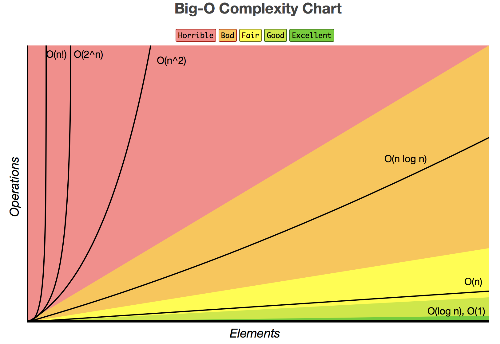
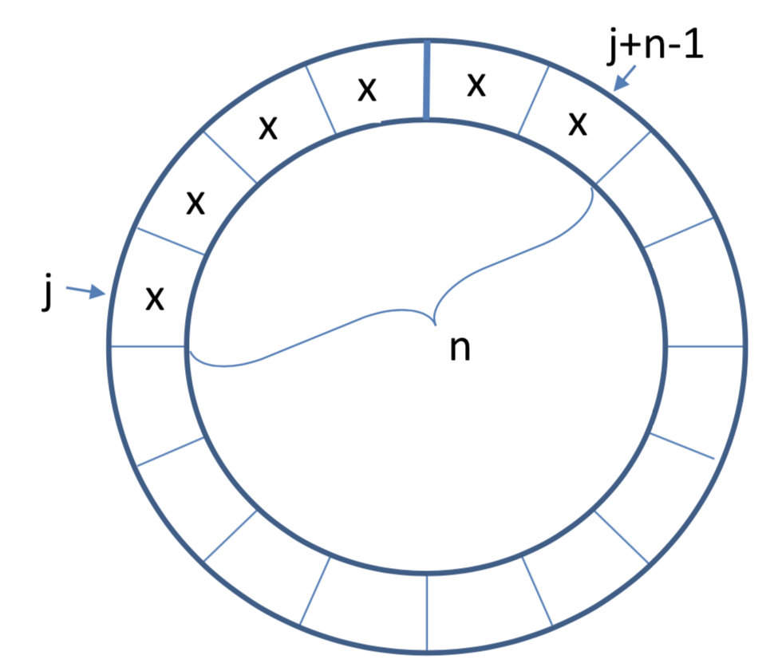
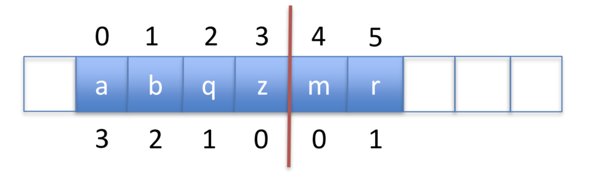
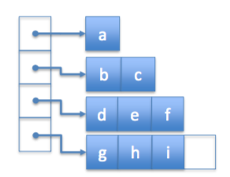
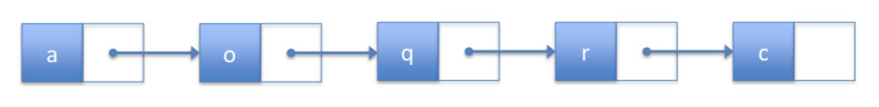
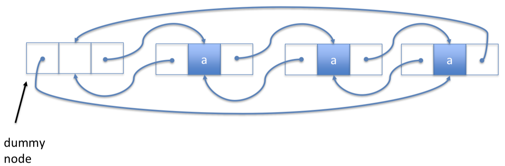
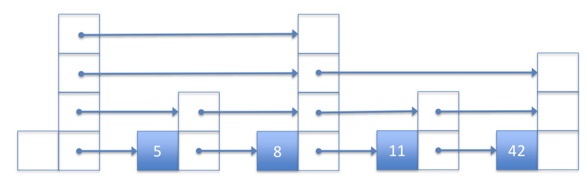

# COMP 2402 Class Notes

## Java Collections Framework (JCF)

The Java Collections Framework (JCF) is a unified architecture for representing and manipulating collections.

_A collection — sometimes called a container — is simply an object that groups multiple elements into a single unit. Collections are used to store, retrieve, manipulate, and communicate aggregate data. Typically, they represent data items that form a natural group, such as a poker hand (a collection of cards), a mail folder (a collection of letters), or a telephone directory (a mapping of names to phone numbers). If you have used the Java programming language — or just about any other programming language — you are already familiar with collections._

In order to use the JCF you can import it like this.

```java
import java.util.*
```

## Sorting

This is how to sort strings based on length by using anonymous object [**Comparator**].

``` java
Collections.sort(list, new Comparator<String>() {
    public int compare(String x, String y) {
        return x.length() - y.length();
    }
});

// or you can use lambda function
list.sort( (String o1, String o2) -> o1.compareTo(o2) );

// if you want to sort by length and also alphabetically
Collections.sort(list,new Comparator<String>() {
    public int compare(String x, String y) {
        // if not same length, use length
        if(x.length() != y.length()) {
            return x.length() - y.length();
        }
        // else compare as strings
        return x.compareTo(y);
    }
});
```

The **compare(x,y)** method works by moving an element left if the **compare(x,y)** method returns a negative integer, and moves the element right if the **compare(x,y)** returns a positive integer. [difference between x and y]

    (-) x < y
    (0) x = y
    (+) x > y

## Maps [Hashmap]

Also known as dictionaries in Swift or C#...

- Cannot have duplicate entries

``` java
Map<String, Integer> map = new HashMap<>();
map.put("Java", 6);
map.put("Swift", 10);
map.put("C#", 7);
map.put("Ruby", 9);

// this will print out every value in the map [foreach]
for(String str : map.keySet()) {
    System.out.println(str + " : " + map.get(str))
}

map.get(key); // fast operation, returns null if no key found
```

## List

Continuing from previous example...

**Map.Entry** is just a key-value pair

``` java
List<Map.Entry<String,Integer>> entryList = new ArrayList<>();
entryList.addAll(map.entrySet); // set containing all the elements

for(Map.Entry<String,Integer> entry : entrylist) {
    System.out.println(entry.getKey() + " : " + entry.getValue() );
}
```

## Deque [ArrayDeque]

Fast for reading/writing at _start_ or _end_ of list. Basically just a flexible stack/queue.

``` java
Deque<String> dq = new ArrayDeque<>();
dq.addFirst("second");
dq.addFirst("first");
dq.addLast("penultimate");
dq.addLast("last");
```

## Priority Queue

Essentially: uses a heap instead of a tree, in order to keep a certain one on top.
So first element is 'sorted' and then rest is unsorted. 

Not good for sorting, or random access.

``` java
Queue<String> pq = new PriorityQueue<>();
pq.addAll(list);

System.out.println(pq.remove());    // remove smallest element
```

If alphabetical, one that starts with 'a' will be removed. After first element, the queue is not sorted. Removing one will promote next smallest to the top

## Asymptotic Notation [Big O]

Used to analyze complexity of algorithms, to find faster, or which ones requires more space.

### Comparing data structures

- Time
- Space
- Correctivenes

### Growth rates proportioanl to n

- If input doubles in size, how much will runtime increase?

### Runtime as a count of primative operation

- This is machine independent
- Proportional to exact runtimess

``` java
for(int i = 0; i < n; i++) {
    arr[i] = i;
}
```

Runtime:

- **1**: assignment [int i = 0]
- **n+1**: comparisons [i < n]
- **n**: increments [i++]
- **n**: array offset calculations [arr[i]]
- **n**: n indirect assignments [arr[i] = i]

### Definition of Big O

After a certain point, g(x) will grow as fast [or faster] than f(x)

- g(x) is the upper limit to f(x)

`O(g(n)) ∀ (f(n) < c•g(n))`

### Orders of growth

| Complexity   | Name         | 
|:-------------|:-------------|
| O(1)         | Constant     |
| O(log n)     | Logarithmic  |
| O(n)         | Linear       |
| O(n log n)   | Quasilinear  |
| O(n^2)       | Quasilinear  |
| O(2^n)       | Exponential  |
| O(n!)        | Factorial    |

</br>



### Tips

- Only largest values matter
- Drop all coefficient
- Log bases are all equivalent

### Example

``` java
public class BigO {
    public static void main() {
        String str = "";
        int n = 100;    // O(1)

        for(int i = 0; ,< n; i++) {     // O(n)
            str += "x";     // O(1) but n times
        }

        for(int i = 0; i < n; i+=2) {    // n/2 times -> O(n)
            str += "y"      // O(1)
        }

        // this is roughly the same as if n was n/2 with O(n)
        for(int i = 0; i < n; i*=2) {    // O(log n)
            str += "y"      // O(1)
        }
    }
}
```

## Array-based Data Structures

### ArrayStack

- Implements **List** interface with an array
- Similar to ArrayList
- Efficient only for stack opertations
- superceded by ArrayDeque
- **get(), set() in O(1 + n-i)**
  - good for accessing the back

### Stacks vs List

| Stack  | List        |
|--------|-------------|
|push(x) |add(n,x)     |
|pop()   |remove(n-1)  |
|size()  |size()       |
|peek(x) |get(n-1)     |

### List Interface

- get(i) / set(i,x)
  - Access element i, and return/replace it
- size()
  - number of items in list
- add(i,x)
  - insert new item x at position i
- remove(i)
  - remove the element from position i

_dereferencing:_ getting the address of a data item

#### Amortized Cost

When an algorithm has processes that may be much longer but usually is quick, so you take the average. [roughly]

e.g. resizing an an array when adding/removing

### ArrayQueue & ArrayDeque

Allow for efficient access at front and backs.



#### ArrayQueue

- Implements **Queue** and **List** interfaces with an array
- Cyclic array, (n: number of elements, j: 'index' of last element)
- **add(), remove() in O(1)**
  - quick to access front or back
  - cannot access anywhere else
- **resize is O(n)**

#### ArrayDeque

- Implements **List** interface with an array
- **get(), set() in O(1)**
- **add(), remove () in O(1 + min(i, n-i))**
  - quick to access front or back
  - not so quick to access middle
- **resize is O(n)**

### DualArrayDeque

- Implements **List** interface
- Uses two **ArrayStacks** front-to-front
- Since arrays are quick to add to the end, this makes front and back operations fast
- May be rebalanced if one array is much larger than the other
- Use Potential Function to decide when to rebalance
- **get(), set() in O(1)**
- **add(), remove() in O(1 + min(i, n-i))**
  - quick to access front or back, but not middle



#### Potential Function

Define a potential function for the data structure to be the absolute difference of the sizes of the two stacks

`P = | front_array.size - back_array.size |`

- Adding or removing an element can only increase/decrease 1 to this function

### RootishArrayStack

- Implements the **List** interface using multiple backing arrays
- Reduces 'wasted space' [unused space]
- At most: _sqrt(n)_ unused array locations
- Good for space efficiency
- **get(), set() in O(1)**
- **add(), remove() in O(1 + n-i)**
  - quick to access the back



## Linked Lists

- Recursive data structure made up of nodes
- Pointers to head and tail, and each node points to the next node
- Efficient add/remove but slow read/write

### SLList [Singly-Linked List]

- Implements the **Stack** and **Queue** interfaces
- **push(), pop() in O(1)**
- **add(), remove() in O(1)**



### DSList [Doubly-Linked List]

- Forward and backwards pointers at each node
- Implements the **List** interfaces
- **get(), set() in O(1 + min(i, n-i))**
- **add(), remove() in O(1 + min(i, n-i))**



### SELList [Space-Efficient Linked List]

- Like a doubly-linked list, but uses block size _b_
- Is a series of **ArrayDeque** with _next_ and _prev_ pointers
- Implements the **List** interfaces
- **get(), set() in O(1 + min(i, n-i)/_b_)**
- **add(), remove() in O(1 + min(i, n-i)/_b_)**
  - is quicker because you can skip blocks of data

## Skiplist

- Like a singly-linked list, with 'skips'
- Randomly generated structure
- Faster searches than linked lists

### SSet Interface

- Additional nodes with pointers that allow 'skipping'
- Successor search: **find(x) will return smallest value >= x**
- **find(), add(), remove() in O(log n)**



## List Implementations

|            | get/set             | add/remove          |
|------------|---------------------|---------------------|
| Arrays     | _O(1)_              | _O(1 + min(i,n-i))_ |
| LinkedList | _O(1 + min(i,n-i))_ | _O(1)*              |
| Skiplist   | _O(log n)_          | _O(log n)_          |

\* given a pointer to a location

## Definitions

**Random variable:** a random sample from a group of values

**Expected value:** average value of a random variable

**Indicator variable:** random variable with values of 0 or 1

**Linearity of Expectation:** the expected value of a sum is equal to the sum of expected values

`Expected height of node [if coin flips were used]:`

    P(x = 1) = 1/2      // prob. that tails on first flip
    P(x = 2) = 1/4      // prob. that tails on second flip
    P(x = 3) = 1/8      // prob. that tails on third flip
    ...
    P(x = i) = 1/(2^i)

    Thus,
    E[x] = i*Sum(1/2^i)       // for all natural numbers
    E[x] = Sum(E[I_j])
    E[x] = Sum(P(I_j = i))

    Indicator variable: 1 if tails, 0 is heads
    P(I_1 = 1) = 1
    P(I_2 = 1) = 1/2
    ...
    P(I_j = 1) = 1/(2^(i-1))

    let S = Sum(P(x = i)) = 1 + 1/2 + 1/4 + ...

    therefore,
    S/2 = 1/2 + 1/4 + 1/8 + ...

    S - S/2 = 1
    => S = 2

     E[x] = Sum(P(I_j = i)) = S = 1 + 1/2 + 1/4 + ...
     E[x] = 2

 `Expected number of elements in the skiplist:`

    E[n_i] = ?

    I_(i,j) = 1 if in list, 0 is not in list
    // i is 0...n-1, number of nodes in list

    // expected value of sum of indicator(element in list)
    E[n_i] = E[ Sum( I_(i,j) ) ]
    E[n_i] = Sum( E[ I_(i,j) ] )
    E[n_i] = Sum( 1/(2^i) )     // average number values in each node
    E[n_i] = n * ( 1/(2^i) )    // average height(node) * number of nodes

`Average height of skiplist:`

    h = # of levels in list

    I_i = 1 if level is not empty, 0 if level empty

    // expected value of sum of indicator(level not empty)
    E[h] = E[ Sum( I_i ) ]      // from 0...infinity [no max height]
    E[h] = Sum( E[ I_i ] )

    I_i ≤ n_i   // if level exists, less likely than number of nodes

    E[I_i] ≤ E[n_i] = n/(2^i)

    // use log(n) since we know to prove O(log n)
    E[h] = E[ I_i ]{ from [0] to [log(n)] }
           + E[ I_i ]{ from [log(n) + 1] to [infinity] }

    E[h] = [ log(n) + 1 ] + [ 1 ]       // because math

    E[h]  = log(n) + 2 ≤ log(n) + 3

`Average length of skiplist:`

    R_i = # of horizontal steps at level ≤ n_i
    l = Sum(R_i)

    E[R_i] ≤ E[ # node height not promoted ]
    E[R_i] ≤ E[ # node height promoted ] - 1
    E[R_i] ≤ S - 1      // S = 2 from above
    E[R_i] ≤ 1

    let sp = total length of search path
    E[sp] = E[h] + E[l]
    E[sp] = ( log(n) + 3 ) + E[ Sum(R_i) ]
    E[sp] = ( log(n) + 3 ) + Sum( E[ R_i ] )
    E[sp] ≤ ( log(n) + 3 )
            + Sum(1){ from [0] to [log(n)] }
            + Sum( E[ n_i ] ){ from [log(n) + 1] to n }
    E[sp] ≤ ( log(n) + 3 )
            + log(n)
            + Sum( n/(2^i) ){ from [log(n) + 1] to n }
    E[sp] ≤ 2*log(n) + 6

    E[sp] = O(log n) + O(1)